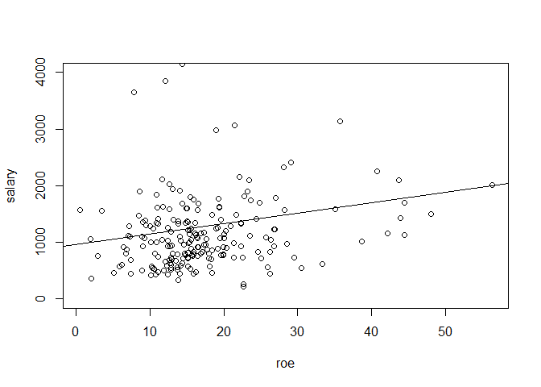
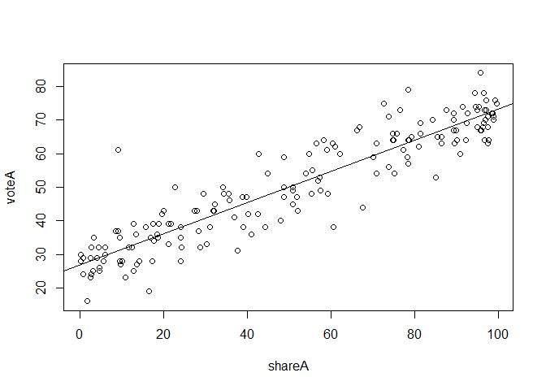

Chapter 2. The Simple Regression ModelModel
================

## 2.1 Simple linear regression

We are concerned with estimating the population parameters $β_0$ and
$β_1$ of the simple linear regression model $$
y = \beta_0 + \beta_1 + \mu
$$ from a random sample of $y$ and $x$. According to Wooldridge (2019,
Section 2.2), the ordinary least squares (OLS) estimators are $$
\hat{\beta}_0 = \bar{y} + \hat{\beta}_1x
$$ $$
\hat{\beta}_1 = \frac{Cov(x, y)}{Var(x)}
$$ Based on these estimated parameters, the OLS regression line is $$
y = \hat{\beta}_0 + \hat{\beta}_1
$$

### Wooldridge, Example 2.3: CEO Salary and Return on Equity

``` r
library(wooldridge)
```

``` r
data(ceosal1, package='wooldridge')
attach(ceosal1)

# manual calculation of OLS coefficients
b1hat <- cov(roe,salary)/var(roe)
b0hat <- mean(salary) - b1hat*mean(roe) 
cat(paste('b0_hat: ', b0hat, '\nb1_hat: ', b1hat))
```

    ## b0_hat:  963.191336472558 
    ## b1_hat:  18.5011863452149

``` r
# "detach" the data frame
detach(ceosal1)
```

Finally, the parameter estimates are calculated. So the OLS regression
line is $$
\hat{salary} = 963.1 + 18.5 roe
$$ The regression results in a variable CEOregres and then use it as an
argument to abline to add the regression line to the scatter plot

``` r
data(ceosal1, package='wooldridge')
# OLS regression
CEOregres <- lm( salary ~ roe, data=ceosal1 )
# Scatter plot (restrict y axis limits)
with(ceosal1, plot(roe, salary, ylim=c(0,4000)))
# Add OLS regression line
abline(CEOregres)
```

<!-- -->

### Wooldridge, Example 2.4: Wage and Education

``` r
data(wage1,package='wooldridge')
#OLSregression:
lm(wage~educ,data=wage1)
```

    ## 
    ## Call:
    ## lm(formula = wage ~ educ, data = wage1)
    ## 
    ## Coefficients:
    ## (Intercept)         educ  
    ##     -0.9049       0.5414

### Wooldridge, Example 2.5: Voting Outcomes and Campaign Expenditures

$$
voteA = \beta_0 +\beta_1 shareA + u
$$

``` r
data(vote1, package='wooldridge')
vote_reg = lm(voteA ~ shareA, data = vote1)
with(vote1, plot(shareA, voteA))
abline(vote_reg)
```

<!-- -->

## 2.2 Coefficients, Fitted Values and Residuals

##### Coefficients

``` r
vote_reg$coefficients
```

    ## (Intercept)      shareA 
    ##  26.8122141   0.4638269

##### Fitted Value $\hat{y_i} = \hat{\beta_0} + \hat{\beta_1}x_1$

##### Residual $\hat{u_i} = y_i - \hat{y_i}$

### Example 2.6: CEO Salary and Return on Equity

``` r
data(ceosal1, package='wooldridge')
# extract variables as vectors:
sal <- ceosal1$salary
roe <- ceosal1$roe
# regression with vectors:
CEOregres <- lm( sal ~ roe )
# obtain predicted values and residuals
sal.hat <- fitted(CEOregres)
u.hat <- resid(CEOregres)
# Wooldridge, Table 2.2:
cbind(roe, sal, sal.hat, u.hat)[1:15,]
```

    ##     roe  sal  sal.hat       u.hat
    ## 1  14.1 1095 1224.058 -129.058071
    ## 2  10.9 1001 1164.854 -163.854261
    ## 3  23.5 1122 1397.969 -275.969216
    ## 4   5.9  578 1072.348 -494.348338
    ## 5  13.8 1368 1218.508  149.492288
    ## 6  20.0 1145 1333.215 -188.215063
    ## 7  16.4 1078 1266.611 -188.610785
    ## 8  16.3 1094 1264.761 -170.760660
    ## 9  10.5 1237 1157.454   79.546207
    ## 10 26.3  833 1449.773 -616.772523
    ## 11 25.9  567 1442.372 -875.372056
    ## 12 26.8  933 1459.023 -526.023116
    ## 13 14.8 1339 1237.009  101.991102
    ## 14 22.3  937 1375.768 -438.767778
    ## 15 56.3 2011 2004.808    6.191886

### Three properties of OLS statistic

$$
\sum_{i=1}^{n} {u_i} = 0 \rightarrow \bar{\hat{u_i}} = 0
$$ $$
\sum_{i=1}^{n} {x_i \hat{u_i}} =0 \rightarrow Cov(x_i,\hat{u_i}) = 0
$$ $$
\bar{y} = \hat{\beta_0} + \hat{\beta_1} \cdot \bar{x}
$$ asdasd
